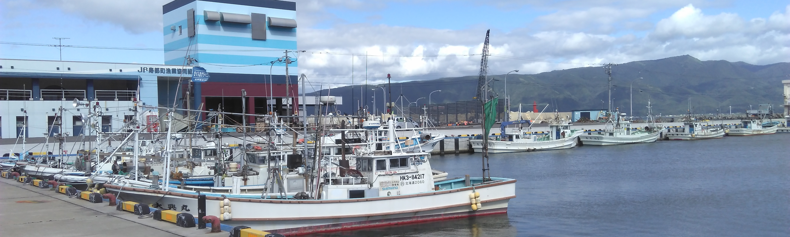

## Me & Contacts

- [E-mail](peacock0803sz@gmail.com)
- [Twitter](https://twitter.com/peacock0803sz)
- Mastodon
    - [peacock0803sz@chikuwa.sweak.net](https://chikuwa.sweak.net/@peacock0803sz)
    - [peacock0803sz@otoya.space](https://otoya.space/@peacock0803sz)
- [GitHub](https://github.com/peacock0803sz/)
- [Blog: Affettoso](http://peacock0803sz.hatenablog.jp/)
- Q&A
    - [peing.net(質問箱)](https://peing.net/ja/peacock0803sz)
    - [marshmallow-qa.com(マシュマロ)](https://marshmallow-qa.com/peacock0803sz?utm_medium=url_text&utm_source=promotion)

## About

### Progranning

- Linux大好きな高校生
- 情報系学部を志望してる
- Vimmerになりたい(VSCodeに甘えている)
芝生

### Music

- 吹奏楽経験者(Bb Clarinet3ヶ月 Bass Clarinet約2年)
- 音楽全般好きだがゆず 平井堅とかは音程悪いので嫌い
- アイドルも同じ理由でダメ
- Classical:
    - Bartok Kodaly Tchaikovsky Mozart Beethovenあたり
    - 管弦楽ばっかり聴いてるので室内楽はそこまで
- Jazz: 上原ひろみ Chick Corea シャープ&フラッツ SQUARE カシオペア
- R&B: Earth,Wind&Fire Maroon5(そこまで深くない)
- Pops: 荒井由実/松任谷由実 中島みゆき さだまさし 山下達郎 水樹奈々 奥華子
<!-- - [#PeacockNP](https://twitter.com/search?f=tweets&q=%23PeacockNP&src=typd)でよくなうぷれ呟いてる -->

<!-- ## History

2000/8/3 北海道札幌市に生まれる
2007/4 市内の小学校に入学
2013/3 同卒業
2013/4 市内の中学校に入学
2016/3 同卒業
2016/4 道立の自称進学校に入学
2017/4 進級するも新クラスで友達が作れず不登校気味に
2018/4/30 同中退
2018/5/1 道内の通信制高校に編入 -->

## Skills

### Learing

- C(独習Cを読みながらやっているがポインタで躓いてる)
- Python(Web記事つまみ食い)
- HTML/CSS/Javascript(このサイトが作れる程度)

### Donation

[Amazon欲しいものリスト](http://amzn.asia/0jq6XgS)